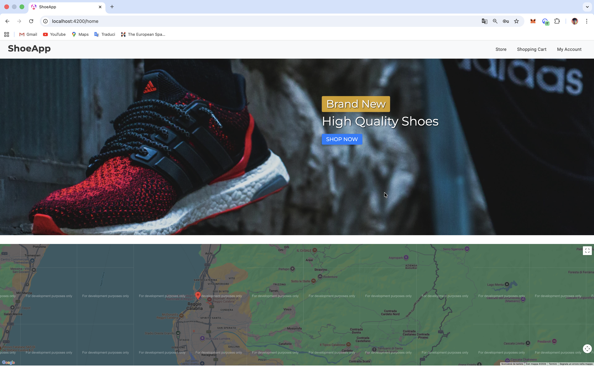
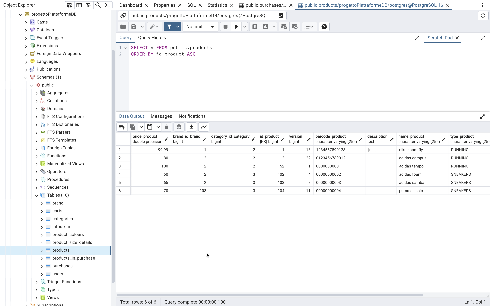
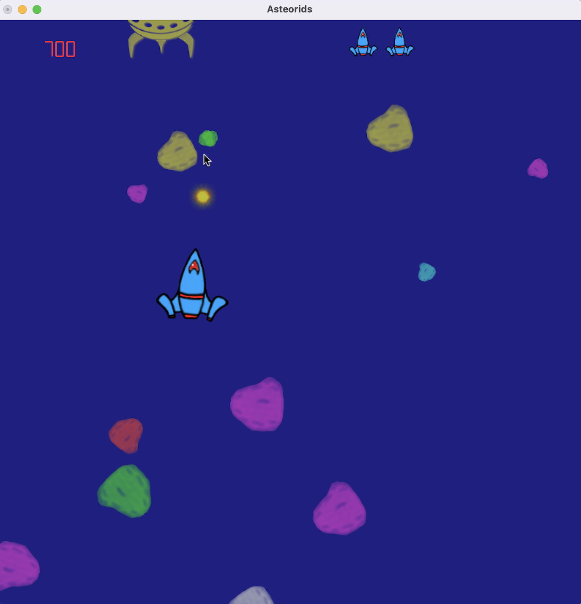
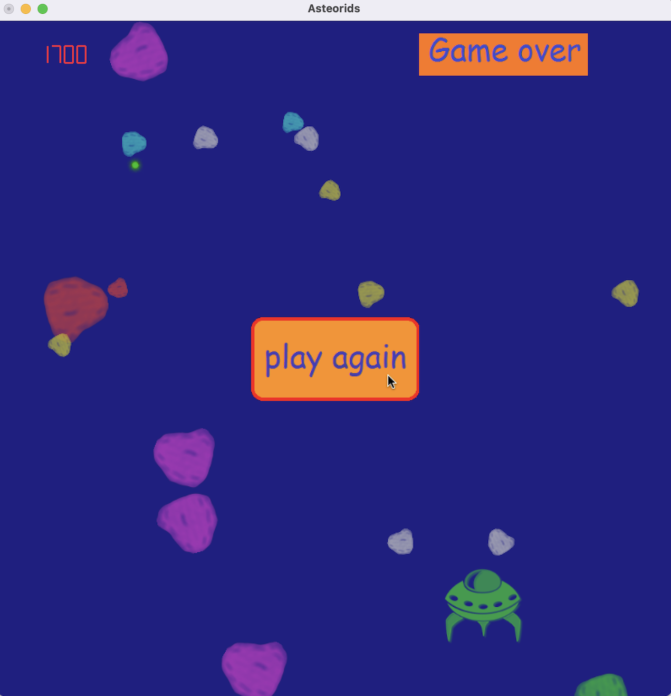

# Selected Academic Projects
→ MSc in Cyber Risk Strategy and Governance (Joint Degree), Bocconi University & Politecnico di Milano 
→ This repository also includes selected academic work completed during my BSc in Computer Engineering at the University of Calabria and exchange experiences at Fairmont State University and the University of Rhode Island (USA)

---

## Dynamic Systems Analysis and Control Modeling

**Course:** Fundamentals of Control Systems
**Focus:** Linear systems analysis, state-space modeling, transfer functions, time/frequency response, continuous and discrete time systems  
**Technologies:** Wolfram Mathematica  

**Description:**  
Analytical project on linear time-invariant (LTI) dynamic systems, developed through both **continuous-time** and **discrete-time** state-space models. The work includes the study of natural modes, free and forced responses, transfer functions, poles and zeros, step/ramp/periodic input responses, and minimum-order input-output representations. The project also examines stability properties, transient and steady-state behavior, and the role of initial conditions in activating specific system modes. All symbolic and computational analyses were carried out using **Wolfram Mathematica**.

📄 [Download PDF (in Italian)](./Relazione Tecnica Progetto FdA_Matteo_Lo_Giudice_231752.pdf)

---

## France – Smart Surveillance: AI-Related Cyber Risks & Governance

**Course:** Institutional Scenarios of Cyber Risk  
**Focus:** AI-related cyber risk analysis, stakeholder mapping, policy & governance, regulatory compliance  
**Description:** Group project analyzing AI-related cyber risks in France, with a focus on smart surveillance systems. The work covers the national and EU regulatory landscape (AI Act, GDPR, Law Enforcement Directive), a full stakeholder analysis (citizens, government, technological supply chain), and a structured risk mapping across cybersecurity, economic, societal, and national security dimensions. The project proposes a governance framework centered around a newly designed national authority (HAIASP) and a 10-action resilience plan to secure the AI-based public video surveillance supply chain while safeguarding fundamental rights and public trust.

📄 [Download PDF](./FranceSmartSurveillance_final_version.pdf)

---

## Ferrari Cyber Security Toolkit (Board-Level)
**Course:** Strategy and Governance for Cyber Risk  
**Focus:** Cybersecurity governance, board awareness, investment justification  
**Description:** Development of a board-level cybersecurity toolkit aimed at supporting strategic decision-making and investment prioritization in cyber risk management

📄 [Download PDF](./ferrari-cyber-security-toolkit.pdf)

---

## Phishing URL Detection using Machine Learning

**Course:** Artificial Intelligence for Security  
**Focus:** Application of supervised, unsupervised, and anomaly detection techniques for phishing URL detection, based on the analysis of structural and lexical characteristics of web addresses 
**Description:** Exploratory Data Analysis (EDA), feature engineering on URL attributes, categorical feature encoding (One-Hot Encoding and Target Encoding), and implementation of supervised classifiers, unsupervised learning approaches, and anomaly detection methods

📄 [Download Jupyter Notebook](./AI_for_Security_Project.ipynb)

---

## NotPetya Impact Analysis – Maersk Global Operations
**Course:** Technology Risk Governance  
**Focus:** Post-incident analysis, systemic risk, business impact  
**Methods:** Fault Tree Analysis (FTA), Swiss Cheese Model, Bow-Tie Analysis, Business Impact Analysis (BIA)

📄 [Download PDF](./notpetya-maersk-risk-analysis.pdf)

---

## Ransomware Risk Modelling via Bayesian Network
**Course:** Methods and Data Analytics for Risk Assessment  
**Focus:** Probabilistic cyber risk modelling in a financial institution  
**Methods:** Bayesian Network, scenario analysis, control effectiveness evaluation

📄 [Download PDF (Presentation)](./ransomware-bayesian-network.pdf)
📄 [Download PDF (Paper)](./Methods_Paper.pdf)

---

## Database Management Systems Project
**Course:** Enterprise ICT Architectures  
**Technologies:** SQL, Neo4j, MongoDB 
**Description:** Comparative analysis and implementation of relational, graph database systems and document-based

📄 [Download PDF (ER model + SQL queries)](./EICTA_Project_1___ER_Model___SQL.pdf)

📄 [Download PDF (Neo4j + BPMN)](./EICTA_Project_2___NEO4j___BPMN.pdf)

📄 [Download PDF (MongoDB)](./EICTA_Project_3___MongoDB.pdf)

---

## Online Auction System – Distributed Client–Server with gRPC & Design Patterns  

**Course:** Software Engineering  
**Focus:** Distributed systems architecture, remote procedure calls, object-oriented design, modularity, testing  

**Programming Language:** Java  
**Technologies:** Google gRPC (Remote Procedure Calls), JUnit  

**Design Patterns Implemented:** Decorator, Builder, Bridge, Composite, Observer  

**Description:**  
Design and implementation of a distributed **online auction system** developed in Java using **Google gRPC** for client–server communication via remote procedure calls (RPC). The project emphasizes modular software architecture and object-oriented design, applying classical design patterns to improve maintainability, extensibility, and separation of concerns.

The work includes **functional and non-functional requirements** definition and prioritization, **UML modeling for each module**, and systematic **unit testing** of modules and features using **JUnit**.

💻 [Open Repository](https://github.com/matteologiudice/Progetto-ING-SOFTWARE-Matteo-Lo-Giudice-231752)

---

## Secure Full-Stack E-Commerce Platform – ShoeApp  

**Course:** Software Platforms for Web Applications  
**Focus:** Secure full-stack development, REST API design, SQL database integration, token-based authentication  
**Technologies:** Java (Spring Boot), PostgreSQL, Angular, Keycloak (OAuth2 / JWT), Google Maps API  

**Description:**  
Design and implementation of a complete full-stack e-commerce platform for online shoe retail. The backend exposes RESTful APIs developed in Java (Spring Boot) and connected to a PostgreSQL relational database (SQL-compliant and database-agnostic architecture). Authentication and authorization are enforced via Keycloak using OAuth2/OpenID Connect with JWT-based stateless access control. The Angular frontend implements product catalog browsing, persistent cart management (including guest-to-authenticated cart merging upon login), user profile, order history, checkout workflow, order confirmation, and Google Maps API integration for location-based services.

  
  

💻 [Frontend Repository](https://github.com/matteologiudice/ShoeApp_WebApplication_FrontEnd) 

⚙️ [Backend Repository](https://github.com/matteologiudice/ShoeApp_WebApplication_BackEnd)

---

## Asteroids – 2D Game with Hierarchical Collision Detection  

**Course:** CSC 406 – Computer Graphics  
**Focus:** Real-time graphics, physics-based animation, collision detection, object-oriented design  

**Programming Language:** C++  
**Libraries & Tools:** OpenGL, GLUT, TGA image textures  

**Techniques Implemented:**
- Hierarchical bounding boxes for optimized collision detection  
- Euclidean distance-based collision checks  
- Physics-based animation using state equations (position, velocity, angular velocity)  
- Mouse-driven dynamic orientation control  
- Spherical world model (screen wrapping mechanics)  
- Linked list data structures for asteroid and missile management  
- Texture-based rendering (.tga images)  
- Real-time score, lives, and health tracking system  

**Description:**  
Development of a 2D *Asteroids*-style game featuring a physics-driven spaceship with thrust and rotational controls, hierarchical collision detection, missile management, dynamically generated asteroids with probabilistic spawning, and additional adversarial entities. The project emphasizes structured object-oriented programming, real-time interaction handling, and computational optimization for collision detection

  
  

👽 [Open Project Directory](./Computer-Graphics/Asteroids)

📄 [Download PDF Report](./Computer-Graphics/Asteroids/report/Report_Programming_Assignment_3_Matteo_Lo_Giudice.pdf)

